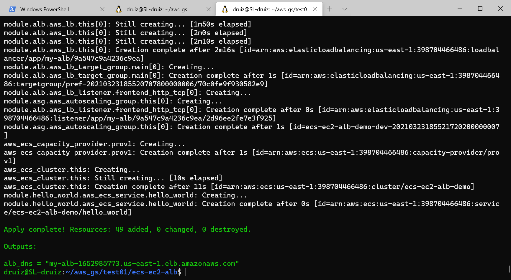
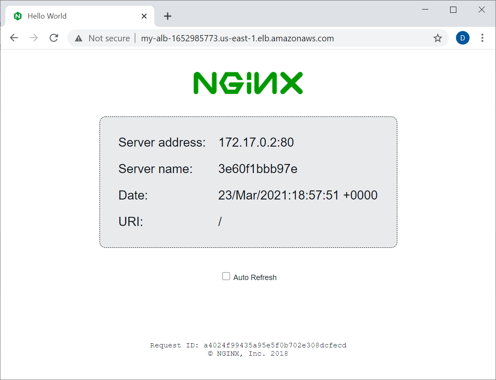
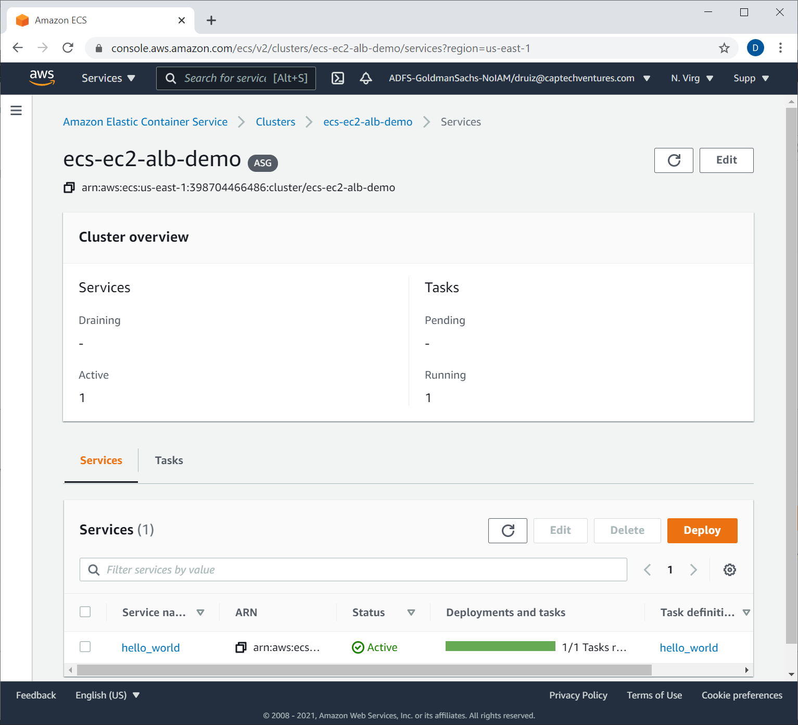

# ECS EC2 ALB Demo

## Setup

This demo assumes you have aws credentials saved in an aws profile called `aws.demo`. In order to use terraform s3 state backend, you'll need to create the S3 bucket.

Example AWS CLI command (bucket name must be unique)
```
aws s3 mb s3://druiz-ec2-ecs-bucket --profile aws.demo
```

Next you can the terraform commands (reference s3 bucket in the options):

```
terraform init \
        -reconfigure \
        -backend-config="bucket=druiz-ec2-ecs-bucket" \
        -backend-config="key=tfstate" \
        -backend-config="region=us-east-1" \
        -backend-config="profile=aws.demo" \
        ./
terraform apply
```

### Output

Terraform outputs the ALB DNS name, a sample nginx hello container will be deployed and connected to this.

ECS Cluster


Drill down to ECS Task to get public IP


Sample Nginx hello using fargate public IP


Additionally a ssh private key gets generated that can be used to connect to a bastion host

```
ssh -i ec2_private_key_pem ec2-user@BASTION_HOST_PUBLIC_IP
```

## Teardown

```
terraform destroy
```

## Recommended Resources

- AWS Sys ops learning path - https://www.linkedin.com/learning/paths/prepare-for-aws-sysops-administrator-certification?u=2079044
- Learning Terraform course - https://www.linkedin.com/learning/learning-terraform-2?u=2079044
- Advanced Terraform course - https://www.linkedin.com/learning/advanced-terraform?u=2079044
- Devops Foundations course - https://www.linkedin.com/learning/devops-foundations-your-first-project?u=2079044
- Docker on AWS (ECS) course - https://www.linkedin.com/learning/docker-on-aws?u=2079044
- Terraform ECS Community Module - https://registry.terraform.io/modules/terraform-aws-modules/ecs
- Terraform ECS Community Module Example - https://github.com/terraform-aws-modules/terraform-aws-ecs/tree/master/examples/complete-ecs
- Terraform ASG Community Module - https://registry.terraform.io/modules/terraform-aws-modules/autoscaling/aws/latest
- Terraform Security Group Community Module - https://registry.terraform.io/modules/terraform-aws-modules/security-group/aws/latest
- Terraform ALB Community Module - https://registry.terraform.io/modules/terraform-aws-modules/alb/aws/latest
- Terraform ECS Capacity provider resource - https://registry.terraform.io/providers/hashicorp/aws/latest/docs/resources/ecs_capacity_provider
- Terraform ECS Cluster resource - https://registry.terraform.io/providers/hashicorp/aws/latest/docs/resources/ecs_cluster
- Terraform ECS Service resource - https://registry.terraform.io/providers/hashicorp/aws/latest/docs/resources/ecs_service
- Terraform ECS Task definition resource - https://registry.terraform.io/providers/hashicorp/aws/latest/docs/resources/ecs_task_definition
- AWS Cloudformation ECS Task definition container definition documentation - https://docs.aws.amazon.com/AWSCloudFormation/latest/UserGuide/aws-properties-ecs-taskdefinition-containerdefinitions.html
