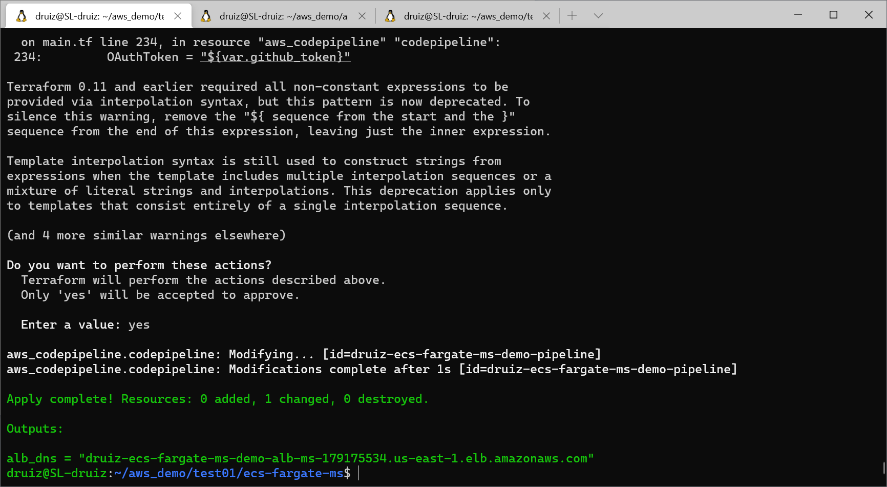
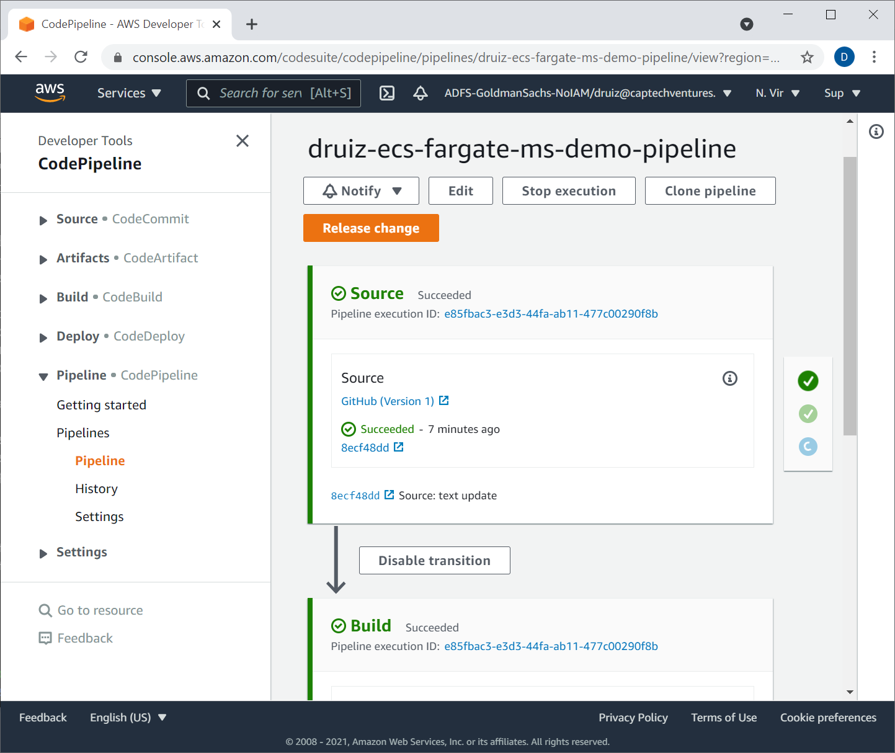
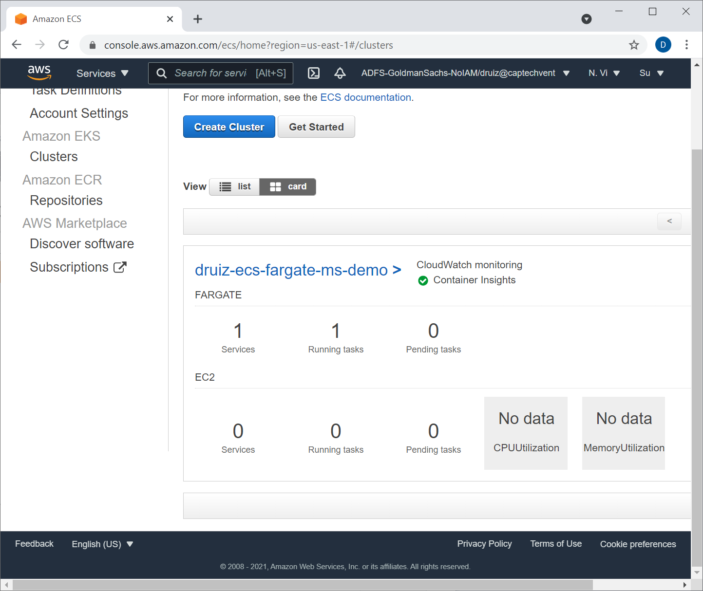
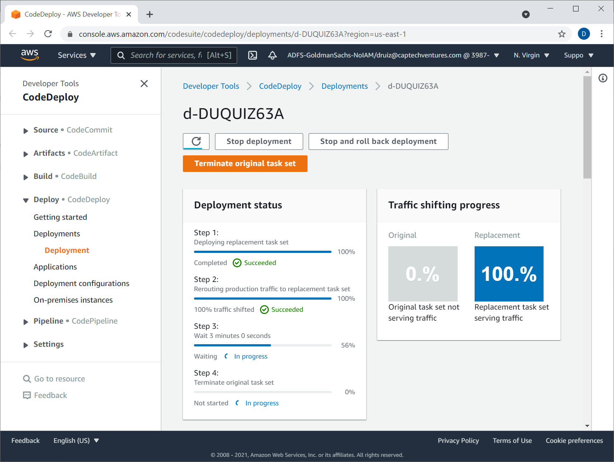
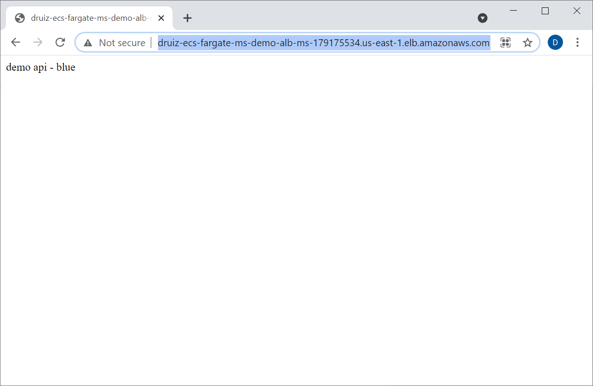

# Simple ECS + Fargate Demo

Related api repository: https://github.com/diego-ruiz-captech/api-demo-app

## Setup

This demo assumes you have aws credentials saved in an aws profile called `aws.demo`. In order to use terraform s3 state backend, you'll need to create the S3 bucket. You'll also need to provide a github token for repo access. AWS codepipeline will setup a polling mechanism to check for repo updates. This is only for demo purposes, ideally codestar connection should be used (which also has a manual step to approve connections).

Example AWS CLI command (bucket name must be unique)
```
aws s3 mb s3://druiz-fargate-ecs-ms-bucket --profile aws.demo
```

Next you can the terraform commands (reference s3 bucket in the options):

```
terraform init \
        -reconfigure \
        -backend-config="bucket=druiz-fargate-ecs-ms-bucket" \
        -backend-config="key=tfstate" \
        -backend-config="region=us-east-1" \
        -backend-config="profile=aws.demo" \
        ./
terraform apply
```

### Output

There's is no explicit terraform output in this demo, however the deployed container can be viewed by using the public ip of the fargate container

Terraform output:


Code pipeline


ECS cluster


Blue/Green Codedeploy


Demo app deployed on ALB url


## Teardown

```
terraform destroy
```

## Known issues

Rerunning terraform may cause issues after running a few deployments. Some resources in the community modules need to have lifecycle meta-arguments (https://github.com/hashicorp/terraform/issues/27360). A work around would be to pull the resources out of the module in the meantime.
