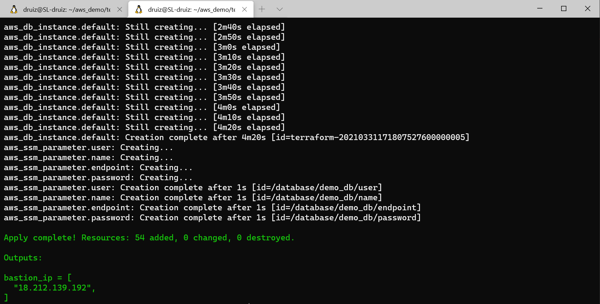
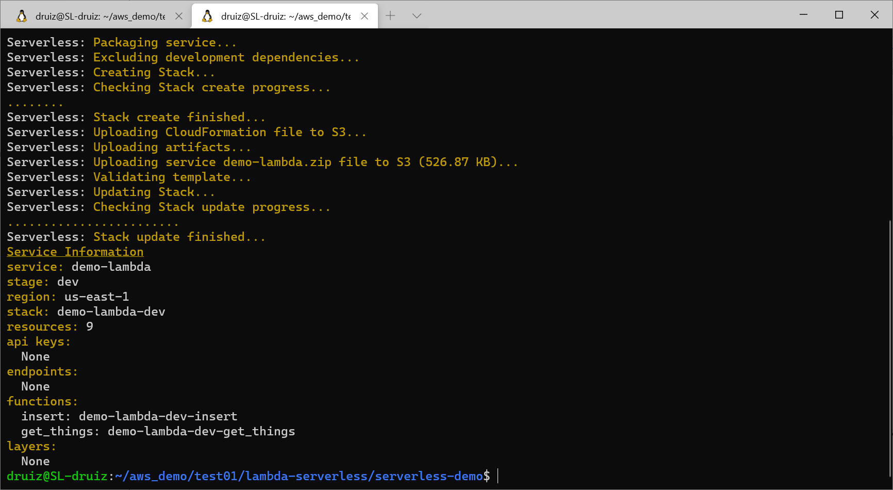
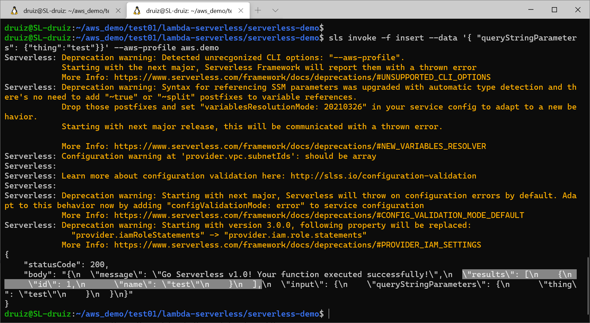
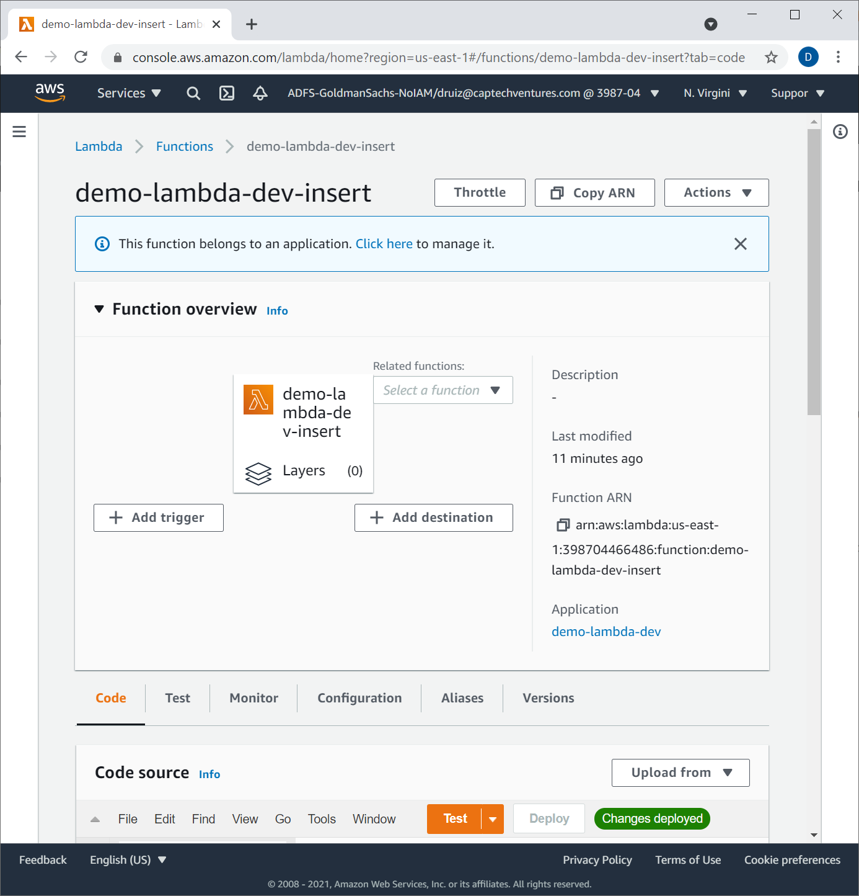
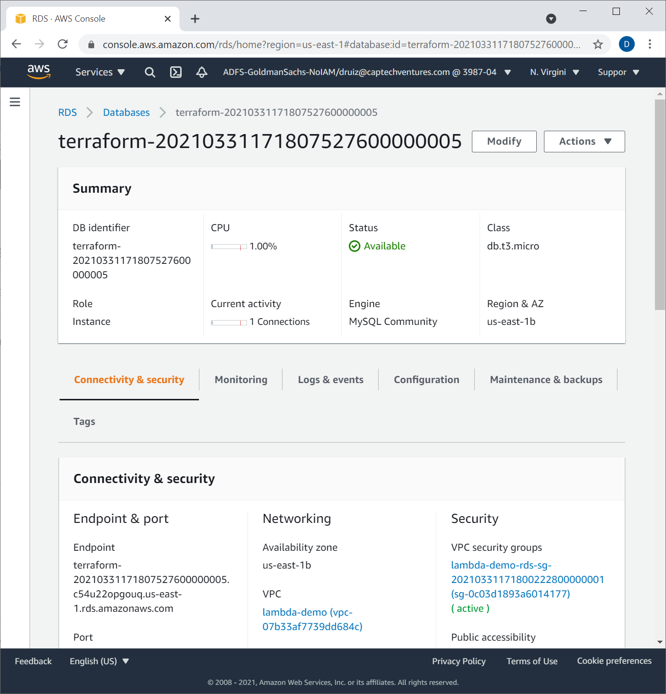

# Lambda Serveless Demo

## Prerequisites

In addition to terraform, the serverless framework is used to deploy the aws lambda function - https://www.serverless.com/framework/docs/providers/aws/guide/installation/ (assumes you have nodejs installed)

## Setup

This demo assumes you have aws credentials saved in an aws profile called `aws.demo`. In order to use terraform s3 state backend, you'll need to create the S3 bucket. A RDS instance will be created that the demo lambda function will connect to and insert records into a database table.

Example AWS CLI command (bucket name must be unique)
```
aws s3 mb s3://druiz-lambda-bucket --profile aws.demo
```

Next you can the terraform commands (reference s3 bucket in the options):

```
terraform init \
        -reconfigure \
        -backend-config="bucket=druiz-lambda-bucket" \
        -backend-config="key=tfstate" \
        -backend-config="region=us-east-1" \
        -backend-config="profile=aws.demo" \
        ./
terraform apply
```

Lambda functions are likely built and deployed by developers, below is an example deployment connecting with the previouls terraform resources (RDS) using the serverless framework. Move into the `serverless-demo` directory and run the following

```bash
# install dependencies 
npm install
# deploy lambda function
sls deploy --aws-profile aws.demo
# invoke function
sls invoke -f insert --data '{ "queryStringParameters": {"thing":"test"}}' --aws-profile aws.demo
```

### Output

There's is no explicit terraform output in this demo, however the deployed container can be viewed by using the public ip of the fargate container

Terraform output


Serverless deploy output


Serverless invoke output


Example Lambda function in aws console


Example RDS instance in aws console


## Teardown

Remove lambda function

```bash
sls remove --aws-profile aws.demo
```

Remove other infrastructure resources

```bash
terraform destroy
```

